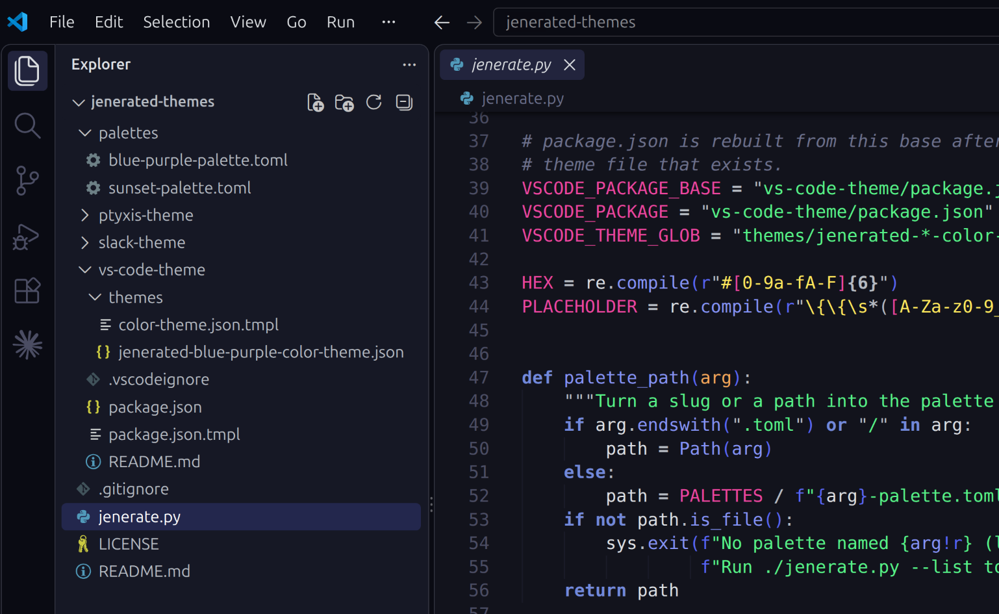

# Jenerated Themes

A small theming engine: pick a color palette, and `jenerate.py` (the
Jenerator) turns it into matching themes for every supported app. You only
get the palettes you ask for, so your apps' theme lists stay short.

The default palette, **Blue Purple**, comes already generated, so you can
install it in any app without running anything.



## Supported apps

Each app has its own folder with a template and install instructions:

- [Obsidian](obsidian-theme/)
- [Ptyxis (Ubuntu terminal)](ptyxis-theme/)
- [Slack](slack-theme/)
- [VS Code](vs-code-theme/)

## Getting started

The quickest way is the setup script. Clone the repository and run it; it
asks which app and which theme you want, then does the rest (on Linux or
macOS):

```bash
git clone https://github.com/savagejen/jenerated-themes jenerated-themes
cd jenerated-themes
./setup.sh
```

### Setting up by hand

To use the default Blue Purple theme, clone the repository and follow the
install steps in each app's folder. To add other palettes (needs Python 3.11
or later):

1. Clone this repository:

   ```bash
   git clone https://github.com/savagejen/jenerated-themes jenerated-themes
   cd jenerated-themes
   ```

2. See which palettes are available (also listed under [Themes](#themes)):

   ```bash
   ./jenerate.py --list
   ```

3. Generate themes for the palettes you want, by slug. Separate several with
   commas, or run it again later to add more:

   ```bash
   ./jenerate.py sunset
   ./jenerate.py sunset,another-palette
   ```

4. Follow the install steps in each app's folder.

To remove a palette's themes again, run `./jenerate.py --remove sunset`.

## How it works

- **Palettes** in [palettes/](palettes/) are TOML files with a `name`, a
  `slug`, and a list of colors named by role (`bg`, `text`, `accent`, `red`,
  `term_bright_cyan`, ...). A color is a `#rrggbb` value or the name of
  another color in the same file.
- **Templates** (the `.tmpl` files in each app's folder) are the app's theme
  file with `{{color_name}}` placeholders where the colors go. A template can
  add transparency after a placeholder, for example `{{accent}}33`. For apps
  that need them, each color is also available as RGB and HSL numbers:
  `{{accent_rgb}}` gives `88, 101, 242`, and `{{accent_h}}`, `{{accent_s}}`
  and `{{accent_l}}` give `235`, `86` and `65`.
- **`jenerate.py`** fills in every template for each palette you name and
  writes the results next to the templates, named after the palette's slug.
  Themes you generated earlier are kept. For VS Code it also rebuilds
  `vs-code-theme/package.json` from `package.json.tmpl`, listing every
  generated theme.

Generated files are ignored by git (see `.gitignore`), so each person's copy
holds only the palettes they chose. The exception is Blue Purple: its
generated files, and a `vs-code-theme/package.json` that lists only it, are
committed as the default. Generating or removing other palettes changes that
`package.json` in your copy; don't commit that change.

Don't edit generated files by hand; change the palette or template and run
`jenerate.py` again.

The templates currently assume a dark palette: the VS Code theme template
sets `"type": "dark"` (`package.json` follows each theme's type), and the
Ptyxis and Obsidian themes only have a dark variant.

## Changing colors

Edit a palette, for example `palettes/sunset-palette.toml`, then run
`./jenerate.py sunset` to regenerate its themes. Reload the apps that use it
to see the change.

If you change the Blue Purple palette or any template, run
`./jenerate.py blue-purple` and commit the regenerated Blue Purple files along
with your change, so the default stays in sync.

You can also keep a palette outside this repository and pass its path:
`./jenerate.py ~/my-palettes/forest-palette.toml`.

## Adding a palette

Copy an existing palette to `palettes/<slug>-palette.toml`, change its `name`,
`slug` and colors, and run `./jenerate.py <slug>`. Every color the templates
use must be defined; if one is missing, `jenerate.py` stops and names it. Add
the palette to [Themes](#themes) below.

A few rules keep generated files safe and valid; `jenerate.py` checks them and
explains any that a palette breaks:

- The `slug` is used in file names, so it's lowercase letters, numbers and
  single dashes, like `deep-blue-sea`.
- A palette in `palettes/` must be named `<slug>-palette.toml`. (A palette
  kept elsewhere and passed by path can be named anything.)
- The `name` can't contain double quotes, slashes, backslashes or line
  breaks. (It also names the Obsidian theme's folder.)
- Every color is a quoted string: `"#rrggbb"` or another color's name.

## Adding an app

1. Create a folder for the app with a template (`<something>.tmpl`) that uses
   the palette's color names.
2. Add a `(template, output)` pair to `TARGETS` in `jenerate.py`. Use
   `{slug}` in the output path so each palette gets its own file. An app
   that needs several files per theme can use `{slug}` as a folder, like
   Obsidian's `obsidian-theme/{slug}/theme.css`.
3. Add the output pattern to `.gitignore` (keeping Blue Purple's files), and
   a README with install steps.
4. Add the app to `setup.sh`, and tests for it in `tests/setup/`.

## Running the tests

Tests live in [tests/](tests/), with one folder per script (`tests/setup/`
for `setup.sh`, `tests/jenerate/` for `jenerate.py`). Run them all with:

```bash
tests/run.sh
```

Each test runs against a temporary copy of the repository (and, for
`setup.sh`, a temporary home folder), so the tests don't touch your generated
or installed themes. The `jenerate.py` tests need Python 3.11 or later and are
skipped without it. Shared helpers are in `tests/lib.sh`.

## Themes

These palettes are included:

- **Blue Purple** (`blue-purple`): dark blue/purple with a near-black
  'midnight' background.
- **Sunset** (`sunset`): dusky plum with a warm coral-orange accent.
