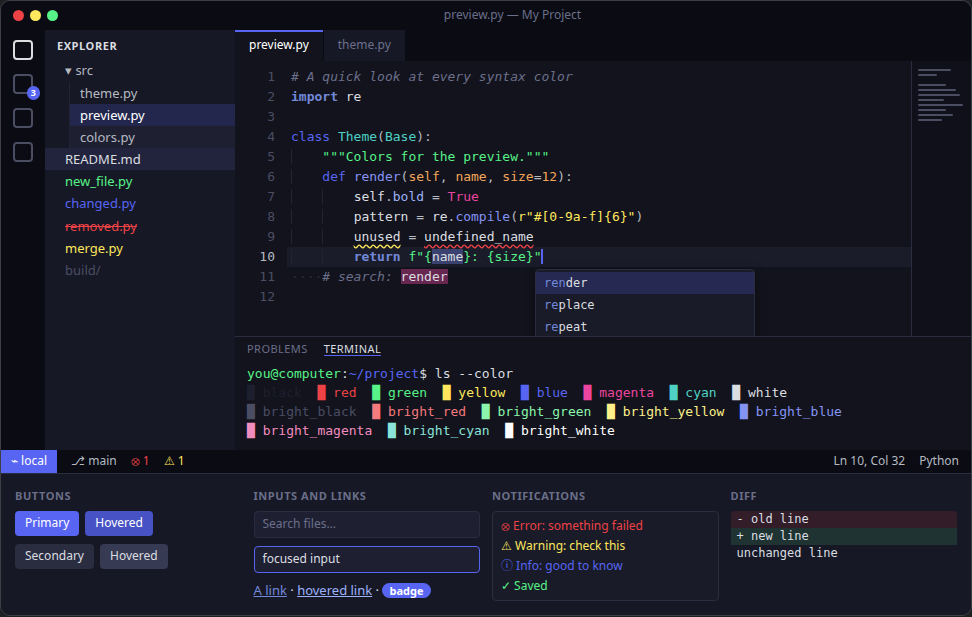
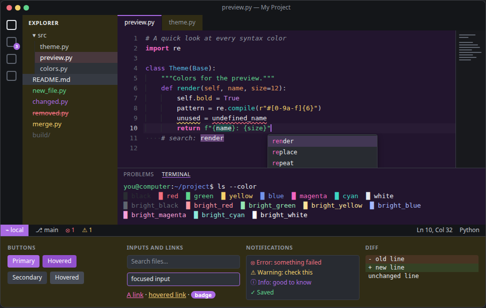
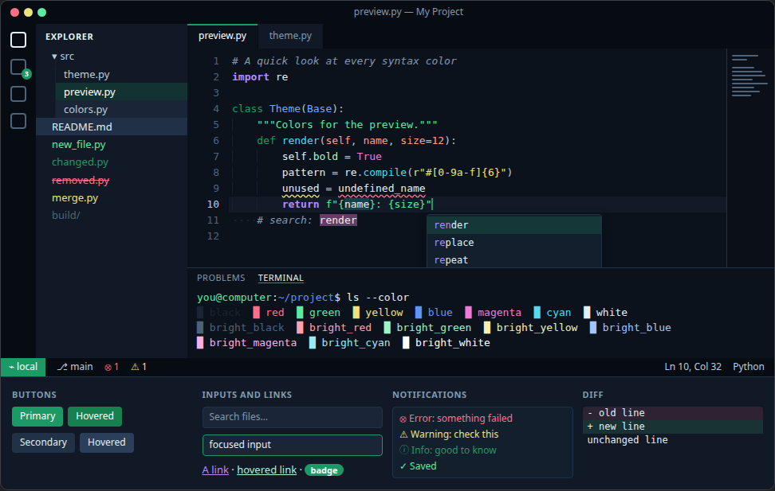
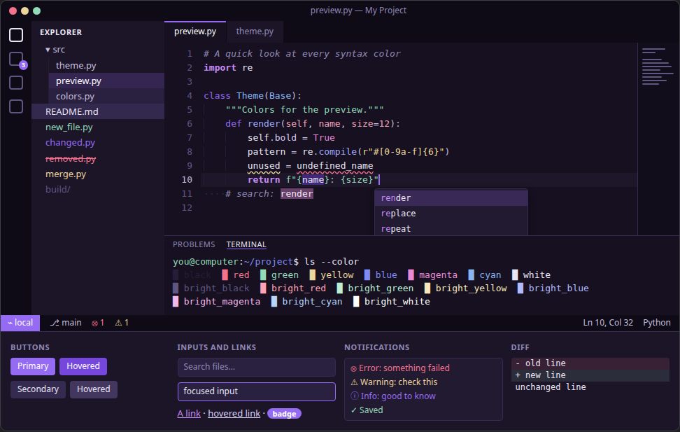
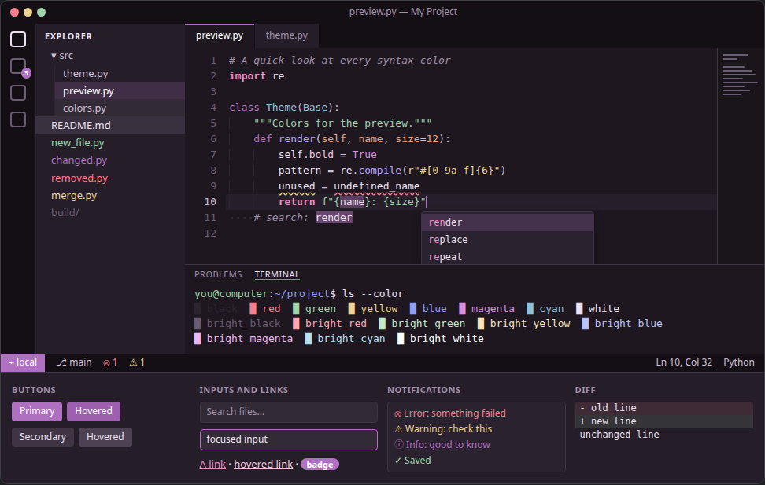
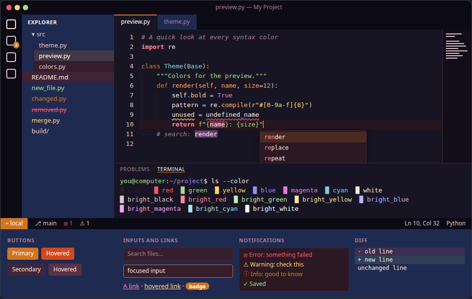
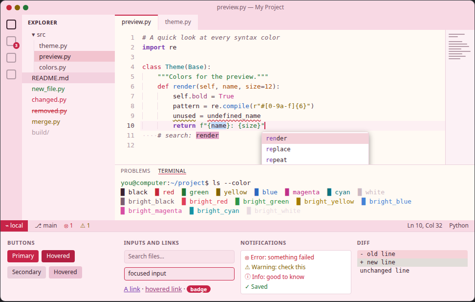

# Palettes

Each palette here is a TOML file of named colors (`<slug>-palette.toml`).
[jenerate.py](../jenerate.py) turns a palette into matching themes for every
[supported app](../README.md#supported-apps), from VS Code and the terminals
to browsers and JetBrains IDEs.

The previews below show each palette in the [Palette Creator](../palette-creator/)'s
preview: a mock app window with an editor and its syntax colors, a file
sidebar, tabs, a terminal with all 16 colors, a status bar, buttons, inputs,
notifications and a diff.

To use a palette, run `./setup.sh` and choose it, or generate its themes
directly with `./jenerate.py <slug>`. To make your own, see
[Adding a palette](../README.md#adding-a-palette).

## Blue Purple

`blue-purple`, the default: its themes come already generated.

Dark blue/purple with high contrast text and a near-black 'midnight'
background, with a blue-purple accent.

Editor `#12131c` · Sidebar `#161825` · Accent `#5865F3` · Text `#DBDEE1`

## Anodized

`anodized`

Anodized titanium: a gunmetal frame around a dark anodized violet editor and
a gold-anodized sidebar, with the rainbow sheen of anodized metal (violet,
magenta, teal, gold, copper and blue) for the accents and syntax. The colors
were sampled from photos of anodized hardware and cutlery, and brightened
where needed for contrast.

Editor `#22152e` · Sidebar `#302c15` · Accent `#a96ae3` · Text `#e7eaee`

## Aurora

`aurora`

The northern lights over a winter night. The backgrounds are the night sky,
the text is icy white, and the accents and syntax colors are the aurora
itself: its signature green, the teal and blue where it thins, the violet of
its upper fringe and the pink of its lower rim.

Editor `#0c121c` · Sidebar `#101925` · Accent `#1c9a66` · Text `#e3eff3`

## Dioxazine

`dioxazine`

Shades of dioxazine purple (PV23), the dark, bluish, red-shade violet
pigment. The backgrounds are its near-black masstone, the text its tints with
white (up to a pale wisteria), the accent its intense glaze, and the syntax
colors its red undertone, its blue side and its pale tints. Strings, errors
and warnings keep a mint, raspberry and pale gold, shifted toward violet, so
"added", "error" and "warning" stay recognizable.

Editor `#161020` · Sidebar `#1c1528` · Accent `#956bf3` · Text `#e9e5f5`

## Mauveheaded

`mauveheaded`

Dusky mauve everything. The backgrounds come from mauve surfaces, the text
is pale mauve, and the accents and syntax colors are mauve, rose and
lavender, with dusty sage, peach, champagne and dusk blue.

Editor `#1e1720` · Sidebar `#251e29` · Accent `#b070c2` · Text `#ece1f0`

## Sunset

`sunset`

A sunset sky, from top to horizon: backgrounds run from blue-black through
warm aubergine to plum-rose, with a dusk-blue sidebar, accents in sunset
orange, rose, gold and orchid, and warm peach-cream text.

Editor `#171523` · Sidebar `#1F2A51` · Accent `#d1751f` · Text `#fbe9df`

## Candy

`candy`

A light palette of sweets: vanilla cream and strawberry-frosting
backgrounds, dark chocolate text, a cherry-red accent, and syntax colors in
deep hard-candy shades of grape, blueberry, orange, lemon, mint, bubblegum and
blue raspberry.

Editor `#fffaf4` · Sidebar `#fdedf2` · Accent `#c72448` · Text `#3b2330`
